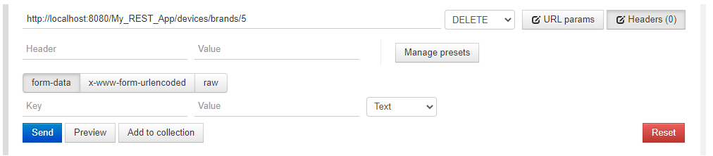
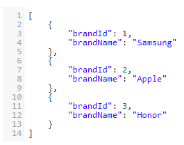

# My_REST_App

This is my Java REST application project. It is used to manage brands and products stored in the database.  
This project has only one commit, when I uploaded it to the repository, because I did not know GIT when I started programming this app.   
I also wrote some unit tests using JUnit.  
I used Eclipse IDE to create this application.

## What is REST ?
REST is an extension of Representational State Transfer.  
REST is a set of practices that define how we should implement web services. REST is based on entities.  
Entities are accessed using appropriate HTTP query types.  
Query types are specified by HTTP verbs: GET, POST, PUT and DELETE.  
These verbs along with the URL define exactly what operation we want to perform on the given entity.  

## About app:
This application provides presentation of all brands and products. Also you can perform actions such as:
- get brands by ID,
- get brands products,
- add new brands to database,
- edit selected brands in database,
- delete selected brands,
- get brands products by category.

All database records are represented in JSON format. Also, when you add a new brand or edit a selected record, you need to use JSON.

## Used technologies
- Glassfish Jersey Framework,
- Maven,
- JUnit,
- Hibernate,
- MySQL database.

# How it works ?

In order to demonstrate the operation of this application, I created two tables in the database:
- brands,
- products. 

Products table contains foreign key which is brandId. A foreign key is a column or a set of columns in a table 
whose values correspond to the values of the primary key in another table.

Then I entered sample values for brands and products:

Brand:

Products:

To check how this application work, I used Google Postman.  
I have provided examples of actions below:
- Get all brands:

- Get brand by ID:

- Add new brand:

- Get all brands after adding a new one:

- Edit brand by ID:

- Get upadeted brand:

- Delete brand by ID:

- Get all brand after delete:

- Get brands products,

-  Get brands products by category:

# Author

Michal Wonia  
Poland
